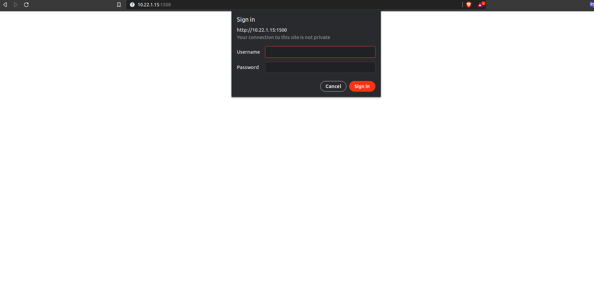
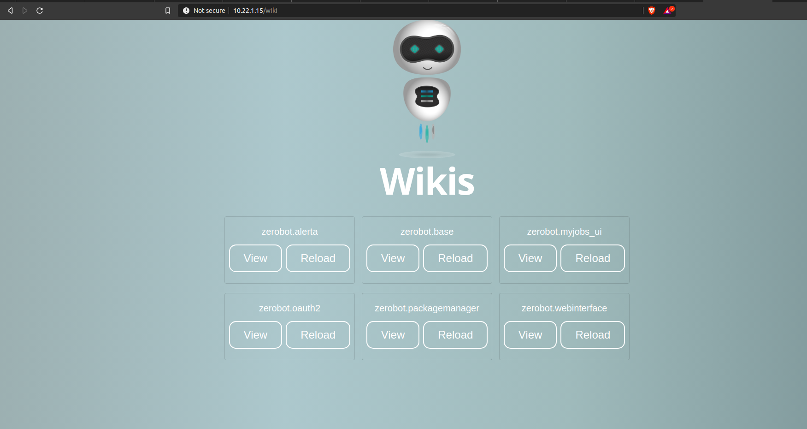

## Threebot reservation

#### This package is used to deploy a threebot on a machine using a chatflow:

* **URL**: {IP}/tfgrid/threebot_provisioning/chat/threebot_reservation
* **description**: your 3bot deployed machine will be an ubuntu machine using specific flist have jumpscale with threebot installed. You can either deploy a new one or restore your threebot.
* **User inputs**:
   - Deploy a new 3bot (if you don't have any 3bot container) or Restore my 3bot (if you already have one and you want to restore it)
   - **ssh key** : add your public ssh key `~/.ssh/id_rsa.pub` that helps to connect using ssh 
   - **corex user**: add a username for your 3bot (this will allow you secure access to the 3bot from your web browser) using coreX
   - **corex password**: add a password for your 3bot (this will allow you secure access to the 3bot from your web browser) using coreX
   - **Ip version**: choose what your prefer to access your 3bot using IPv4 or IPv6? If unsure, chooose IPv4
   - **IP range**: Configure IP to manually provide an IP range to use or Choose IP range for me to generate an IP range automatically
   - **Network name**: a name for the network to deploy on,  if left empty it will be a generated name
   - **IP Address**: choose the ip address for your 3bot machine.
   - **Backup password**: in case you want your 3bot to be automatically backed up (in s3) a password should be provided. You will later use it to restore your 3bot.
* **User setup** 
    - register user threebot on explorer ```kosmos "j.tools.threebot.init_my_threebot(name=3bot_NAME,email=EMAIL)"``` Note: name of 3bot is (your 3bot name).3bot , email is your 3bot email
    - Install [wireguard](https://www.wireguard.com/install/)


After the deployment of the threebot is complete,  a url will be returned that can be used to access it after up your wireguard configuration.

## Screenshots:


